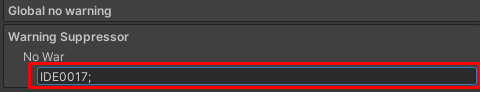

# Warning Suppressor
## EN-US
### Installation
Installation using scoped registries</br>
</br>
Installation using add package from git url</br>

### Global no warning
Global warning suppressor is used to generate warning suppression for all assemblies.<br/>
<br/>
Enter CheckID in the field below 'No War' and end with ';'.<br/>
<br/>
```
exp:
	IDE0017;IDE0018;IDE0019;
```
### Individual no warning
Local warning suppressor creates specific deletions for each assembly.<br/>
<br/>
#### Applay no warning
This option ensures that local suppression is applied at the expense of global suppression.
#### Applay global no warning
This option applies global suppression if local suppression is not checked.
#### No War
Enter CheckID in the field below 'No War' and end with ';'.
```
exp:
	IDE0017;IDE0018;IDE0019;
exp[For object members]:
	//~F:For field
	//~P:For property(Including indexers)
	//~T:For type(As class, delegate, enum, interface, and struct)
	//~M:To method(Including constructors, deconstructors, and operators)
	//~E:For event
	IDE0051>~M:NameSpaceTest.ClasseTest.MethodTest;IDE0051>~M:NameSpaceTest.ClasseTest.MethodTest(System.Int32);
```
## PT-BR
### Instalação
Instalação usando scoped registries</br>
</br>
Instalação usando add package from git url</br>

### Global no warning
O supressor de aviso global é usado para gerar supressão de aviso para todos os assemblies.<br/>
<br/>
Digite CheckID no campo abaixo de 'No War' e termine com ';'.<br/>
<br/>
```
exp:
	IDE0017;IDE0018;IDE0019;
```
### Individual no warning
Supressor de aviso local cria supressões especificas para cada montagem.<br/>
<br/>
#### Applay no warning
Essa opção garante que a supressão local seja aplicada em detrimento da supressão global.
#### Applay global no warning
Essa opção aplica a supressão global caso a supressão local não esteja marcada.
#### No War
Digite CheckID no campo abaixo de 'No War' e termine com ';'.
```
exp:
	IDE0017;IDE0018;IDE0019;
exp[Para membros do objeto]:
	//~F:Para campo
	//~P:Para propriedade(Incluindo indexadores)
	//~T:Para tipo(Como class, delegate, enum, interface e struct)
	//~M:Para método(Incluindo construtores, desconstrutores e operadores)
	//~E:Para evento
	IDE0051>~M:NameSpaceTest.ClasseTest.MethodTest;IDE0051>~M:NameSpaceTest.ClasseTest.MethodTest(System.Int32);
```