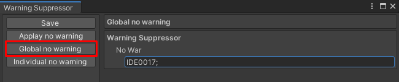

# Warning Suppressor
## Global no warning
Global warning suppressor is used to generate warning suppression for all assemblies.<br/>
<br/>
Enter CheckID in the field below 'No War' and end with ';'.<br/>
<br/>
```
exp:
	IDE0017;IDE0018;IDE0019;
```
